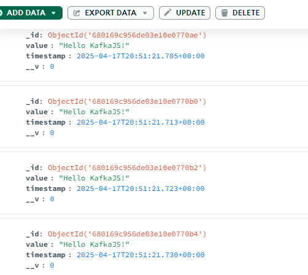
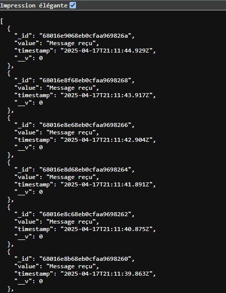

Parfait ! Voici un exemple de fichier `README.md` prêt à être utilisé pour documenter ton projet Kafka + Node.js + MongoDB + API REST. Tu pourras y insérer des captures d’écran dans les sections prévues.

---

### ✅ Fichier `README.md`

```markdown
# 📡 Kafka Message Pipeline avec Node.js, MongoDB et API REST

Ce projet démontre une architecture simple où des messages Kafka sont produits, consommés, enregistrés dans une base de données MongoDB, puis exposés via une API REST avec Express.js.

---

## 🛠️ Technologies utilisées

- [Node.js](https://nodejs.org/)
- [KafkaJS](https://kafka.js.org/)
- [MongoDB](https://www.mongodb.com/)
- [Express.js](https://expressjs.com/)
- [Apache Kafka](https://kafka.apache.org/)

---

## 📁 Structure du projet

```
.
├── producer.js         # Producteur Kafka
├── consumer.js         # Consommateur Kafka + insertion MongoDB
├── api.js              # API REST pour exposer les messages
├── package.json
├── README.md
```

---

## ⚙️ Installation

### 1. Cloner le dépôt

```bash
git clone https://github.com/BintaBall/kafka_tp6.git
cd kafka_tp6
```

### 2. Installer les dépendances

```bash
npm install
```

---

## 🚀 Lancement des services

### 1. Démarrer Zookeeper et Kafka

```bash
# Exemple si tu es dans le dossier kafka
bin\windows\zookeeper-server-start.bat config\zookeeper.properties
bin\windows\kafka-server-start.bat config\server.properties
```

### 2. Démarrer le producteur

```bash
node producer.js
```

### 3. Démarrer le consommateur

```bash
node consumer.js
```

### 4. Démarrer l'API Express

```bash
node api.js
```

---

## 🌐 API REST

### Endpoint : `GET /messages`

Retourne la liste des messages enregistrés depuis Kafka :

```json
[
  {
    "_id": "661f0a2d5c9d3a2642e2df1b",
    "value": "Hello KafkaJS user!",
    "timestamp": "2025-04-17T19:45:17.473Z",
    "__v": 0
  },
  ...
]
```

---

## Captures d'écran


### Kafka Consommateur (MongoDB)



###  API REST (Navigateur)




---

## 👩‍💻 Auteur

Binta Ball – [GitHub](https://github.com/BintaBall)  
Projet académique en Génie Informatique – Data Science / IA

---

## 📄 Licence

Ce projet est open-source sous licence MIT.
```

---
